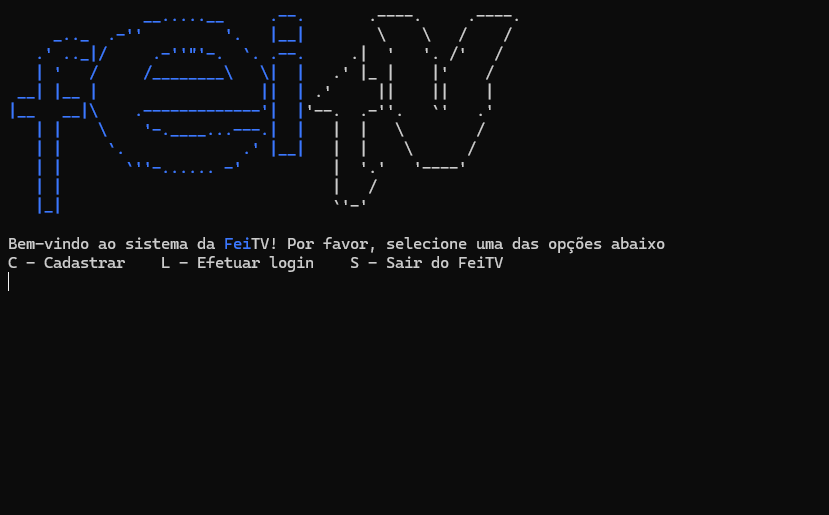
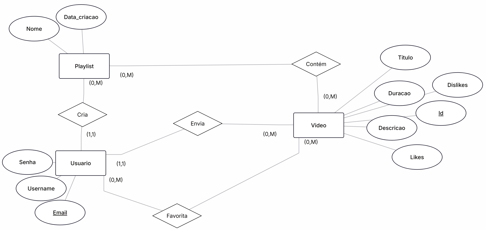
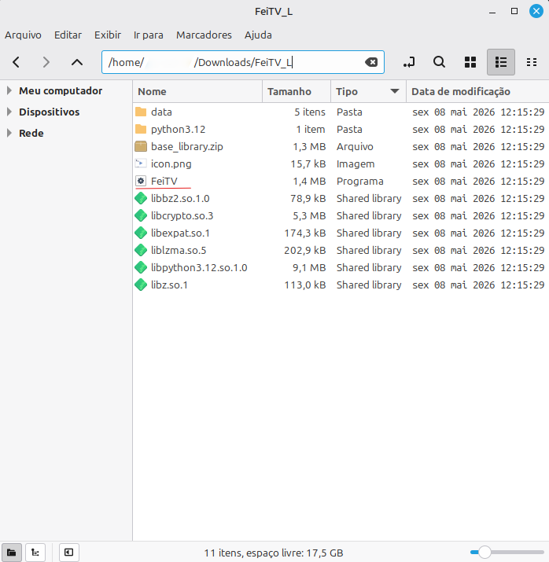
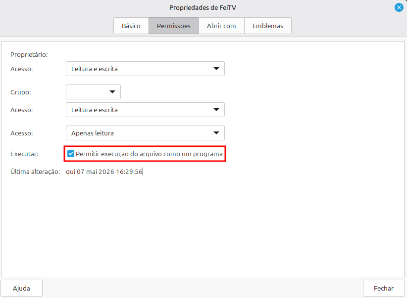
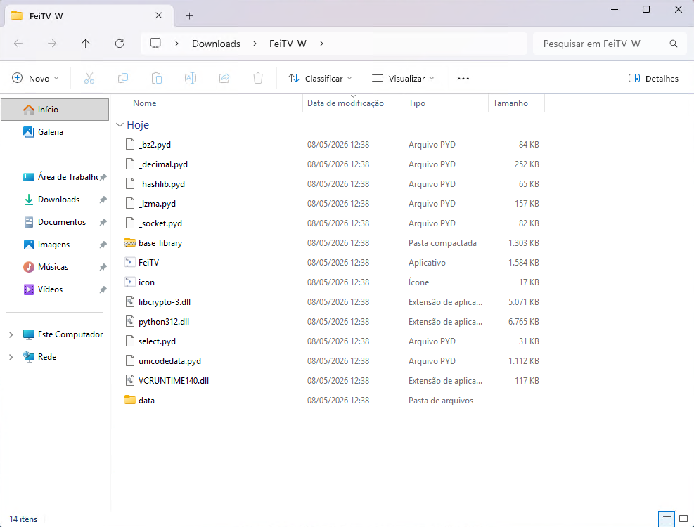

# FeiTV


O projeto FeiTV é uma aplicação de linha de comando desenvolvida em Python que busca funcionar conceitualmente de forma similar a uma plataforma como o Youtube.  

## Sumário
- [Funcionalidades](#funcionalidades)  
- [Detalhes](#detalhes)  
- [Download e Uso](#download-e-uso)

## Funcionalidades
### Para usuários comuns:
- Cadastro, login, edição de perfil (nome e email) e exclusão de perfil;
- Upload de vídeo, edição das informações do vídeo (título, descrição e duração) e exclusão do vídeo;
- Criação de playlists, renomeação de playlists, remoção de vídeo da playlist e exclusão completa da playlist;
- Acessar detalhes de qualquer vídeo, curtir, descurtir e adicionar esses vídeos a playlists;
- Verificar a lista de todos os vídeos favoritados;
- Verificar as informações do próprio perfil com seus vídeos enviados e a dos perfis de outros usuários com os vídeos enviados por eles.
### Para usuários administradores:
- Todas as funcionalidades de um usuário comum;
- Ver estatísticas da plataforma (vídeos mais curtidos, quantidade de usuários e de vídeos cadastrados);
- Ver uma lista de todos os usuários da plataforma;
- Remover qualquer usuário da plataforma;
- Remover qualquer vídeo da plataforma.

## Detalhes
### Como a aplicação funciona?
A aplicação utiliza arquivos .txt como seu banco de dados, cada um desses arquivos armazena uma lista de dicionários convertida em string. Para a leitura e manipulação dos dados armazenados, a função **literal_eval** do módulo **ast** realiza a conversão desses dados em string para objeto (nesse caso, uma lista de dicionários) novamente.  
A todo o momento da execução o usuário recebe diversas opções de interação (por exemplo, digitar S para sair ou Q para iniciar uma função de pesquisa de vídeos), a opção selecionada pelo usuário é enviada para o fluxo principal da operação, que chama uma função de acordo. Toda função, no final, permite que o usuário envie novamente uma opção para o fluxo principal, garantindo que a aplicação continue em funcionamento até que o usuário opte por sair.
### Arquivos e diretórios
- **main.py**: Define o fluxo geral da aplicação.  
Primeiro, garante que o diretório e os arquivos que funcionam como base de dados da aplicação existam para serem manipulados.  
A partir daí, mantém o programa ativo em repetição, definindo a partir das ações do usuário quais funções utilitárias serão executadas até que o usuário execute a opção de sair da aplicação.  
Lida também com o estado de autenticação do usuário em uma conta.
- **utils.py**: Módulo com todas as funções que a aplicação deve ser capaz de executar.  
Nesse arquivo estão salvas variadas funções que permitem o funcionamento da aplicação, desde funções relacionadas a manipulação dos dados (cadastro, exclusão de conta, upload de vídeo, edição das informações do vídeo, etc.) até funções relacionadas a interface com a qual o usuário interage (listagem de vídeos e usuários em formato de tabela, exibição de "letreiro" da plataforma, limpeza das informações da tela, exibição do perfil de um usuário, etc.)
- **icons/**: Diretório com ícones para os executáveis da aplicação em formato .ico para plataforma Windows e .png para plataforma Linux.
- **doc_assets/**: Imagens de documentação para o readme do repositório.
- **specs/**: Arquivos .spec que especificam as configurações a serem usadas pelo Pyinstaller para construção dos executáveis de acordo com a plataforma (Windows ou Linux).
### Modelo de dados
Na fase de planejamento do programa, um modelo entidade-relacionamento foi construído para guiar a ideia de como armazenar e relacionar os dados:  

  

Na prática, durante a implementação dos arquivos de dados em formato .txt, foram realizadas as seguintes alterações:
- **Usuários**:
    - ID numérico autoincremental definido como identificador;
    - Data de criação da conta adicionada no momento de cadastro;
    - Adição de um campo "função" que define se o usuário terá privilégios de administrador ou apenas acesso de um usuário comum.
- **Vídeos**:
    - Data de envio do vídeo adicionada no momento do upload.
- **Playlists**:
    - A data de criação da playlist foi removida;
    - Um ID autoincremental para a playlist foi criado;
    - Um campo "vídeos" que armazena uma lista com os IDs dos vídeos que estão incluídos na playlist;
    - Um campo que associa a playlist ao usuário a qual ela pertence.
- **Favoritos**:
    - Arquivo que associa um usuário a uma lista que armazena os IDs de todos os vídeos curtidos por ele.
- **Dislikes**:
    - Arquivo que associa um usuário a uma lista que armazena os IDs de todos os vídeos descurtidos por ele.
## Download e Uso
**Observação**: As pastas compactadas disponibilizadas abaixo contém dados de mockup já adicionados nela para teste da aplicação.
### Linux:
**Link para download: [FeiTV_L.zip](https://github.com/SRochaGabriel/proj-feitv/releases/download/v1.0/FeiTV_L.zip)**  
O diretório descompactado estará assim:  

  

O executável **FeiTV** deverá ser mantido na pasta e executado pelo terminal com o comando ```./FeiTV``` (caso esteja no diretório do executável, caso contrário, o caminho até o executável virá antes da /). Para executar a aplicação de fora do diretório do executável, crie um atalho .desktop.  
Caso esteja iniciando o aplicativo pela primeira vez e receba um erro de permissão negada, basta utilizar o comando ```chmod +x ./FeiTV``` para permitir a execução ou, então, abrir as propriedas do arquivo e, na aba "Permissões", marcar a caixa de permissão como na imagem:  

  

### Windows: 
**Link para download: [FeiTV_W.zip](https://github.com/SRochaGabriel/proj-feitv/releases/download/v1.0/FeiTV_W.zip)**  
O diretório descompactado estará assim:  

  

O executável **FeiTV** precisa ser mantido na pasta para funcionar corretamente. Para não precisar abrir o diretório sempre que for iniciar a aplicação, o usuário pode criar um atalho.
### Clonando o repositório ou baixando o código:
Caso tenha clonado ou realizado download do código do projeto, basta executar o arquivo **main.py**  
- No Linux: ```python3 ./main.py```  
- No Windows: ```python ./main.py```  

Para compilar o programa, os arquivos .spec já estão configurados para que o Pyinstaller gere um diretório com tudo necessário para o funcionamento do executável, junto com os dados presentes nos arquivos .txt no momento da compilação e o ícone da aplicação.  
Com o Pyinstaller instalado no Python, o comando ```pyinstaller [nomeDoArquivo].spec``` irá compilar o projeto de acordo com as especificações do arquivo.